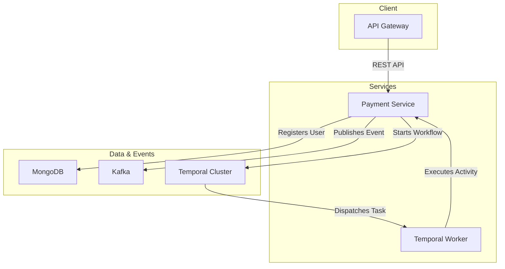

# 1. Title & High-Level Overview

**Project Name:** Distributed Payment Application

**Elevator Pitch:** A highly-available, event-driven payment processing system built on a microservices architecture. It leverages Temporal.io for fault-tolerant orchestration and Kafka for asynchronous communication, ensuring reliable transaction processing at scale.

# 2. System Architecture & Data Flow



**Lifecycle of a Core Request (User Registration & First Transaction):**

1.  **Ingress:** A user registration request hits the **API Gateway**, which forwards it to the **Payment Service**.
2.  **Initiation:** The **Payment Service** receives the request, validates it, and saves the new user's data to the **MongoDB** database with an initial "PENDING" status.
3.  **Orchestration:** The service then initiates a `userRegisterWorkflow` in the **Temporal Cluster**. This workflow manages the entire user lifecycle, from registration to deletion.
4.  **Asynchronous Processing:** The **Temporal Worker** picks up the workflow task and executes the `userRegister` activity.
5.  **Event Publishing:** Upon successful registration, the **Payment Service** publishes a `USER_REGISTERED` event to a **Kafka** topic.
6.  **Transaction Signaling:** When a payment is made, a separate process (e.g., a Kafka consumer) signals the running workflow via `balanceCreditedWorkflow`, updating the user's balance and moving the workflow to the next state.

# 3. System Design Principles & Trade-offs

*   **Scalability & Concurrency:**
    *   **Horizontal Scaling:** The system is designed for horizontal scaling. Both the **Payment Service** and **Temporal Workers** can be scaled independently to handle increased load.
    *   **Asynchronous Processing:** By leveraging **Kafka** and **Temporal**, the system avoids blocking calls, allowing for high throughput and concurrent processing of thousands of transactions.
    *   **Connection Pooling:** The Spring Boot application utilizes connection pooling to efficiently manage connections to the **MongoDB** database.

*   **Fault Tolerance & Reliability:**
    *   **Stateful Orchestration:** **Temporal.io** is used to maintain the state of each workflow, ensuring that transactions are never lost, even if a service instance fails. The built-in retry mechanisms with exponential backoff handle transient failures gracefully.
    *   **Dead-Letter Queues (DLQ):** Although not explicitly shown in the provided code, a production-ready implementation would include DLQs in **Kafka** to handle messages that cannot be processed after multiple retries.
    *   **Circuit Breakers:** In a more complex system with multiple microservices, circuit breakers would be implemented to prevent cascading failures.

*   **Data Consistency & Idempotency:**
    *   **Database Choice:** **MongoDB** was chosen for its horizontal scalability and flexible schema, which is well-suited for user profile data. While it doesn't provide the same ACID guarantees as a relational database, the use of Temporal ensures eventual consistency.
    *   **Idempotency:** Temporal's workflow IDs are used to ensure that workflows are idempotent. If the same user registration request is received multiple times, it will not result in duplicate workflows.

# 4. Tech Stack

*   **Backend Core:**
    *   **Java & Spring Boot:** For building a robust, production-ready microservice.
*   **Orchestration & Async:**
    *   **Temporal.io:** For orchestrating long-running, fault-tolerant workflows.
    *   **Kafka:** For decoupled, asynchronous communication between services.
*   **Data Storage:**
    *   **MongoDB:** As the primary database for user data, chosen for its scalability.
*   **Infrastructure & DevOps:**
    *   **Docker:** For containerizing the application.
    *   **Bazel:** For building and testing the application.

# 5. API Contracts & Data Models

**API Endpoint Example (User Registration):**

`POST /api/users/register`

**Request:**

```json
{
  "userName": "John Doe"
}
```

**Response:**

```json
{
  "id": "60d5f3f7e8a9c2b3e4f5g6h7",
  "userName": "John Doe",
  "balance": 0,
  "status": "PENDING"
}
```

**Core Database Schema (MongoDB `users` collection):**

```json
{
  "_id": "60d5f3f7e8a9c2b3e4f5g6h7",
  "userName": "John Doe",
  "balance": 100.00,
  "status": "ACTIVE"
}
```

# 6. Deployment & CI/CD Strategy

*   **Infrastructure:** The application is designed to be deployed in a containerized environment, such as **Kubernetes**. The infrastructure would be managed using **Terraform**.
*   **CI/CD Pipeline:** A typical CI/CD pipeline for this project would involve:
    1.  **Linting & Static Analysis:** To ensure code quality.
    2.  **Unit & Integration Testing:** To verify the correctness of the application.
    3.  **Docker Image Building:** To package the application into a Docker image.
    4.  **Deployment:** To deploy the application to a Kubernetes cluster using **Helm** charts.

# 7. Local Setup & Run Instructions

1.  **Prerequisites:**
    *   Java 11+
    *   Docker
    *   Docker Compose
    *   Bazel

2.  **Environment Variables:**
    *   Create a `.env` file in the root of the project with the following content:

    ```
    SPRING_DATA_MONGODB_URI=mongodb://localhost:27017/paymentapp
    SPRING_KAFKA_BOOTSTRAP_SERVERS=localhost:9092
    TEMPORAL_SERVER=localhost:7233
    ```

3.  **Run the application:**
    *   Start the required services (MongoDB, Kafka, Temporal):

    ```bash
    docker-compose up -d
    ```

    *   Build and run the application:

    ```bash
    bazel run //:paymentapplication
    ```
